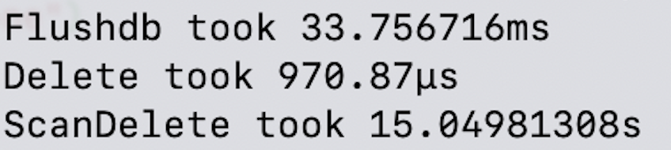

Difference using delete by pattern vs flushdb.

Instead of put everything in one redis database, you can: define segments of your data, and put it on multiple database.
Therefore to delete the thoose data segments, you can use only "FLUSHDB" instead of "SCAN" and "DEL".

This is the time difference between FLUSHDB (33 ms) and SCAN-DEL (15 seconds).

